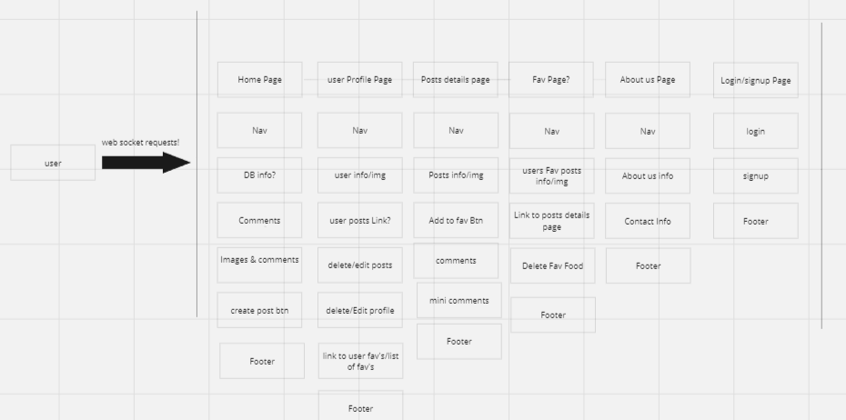
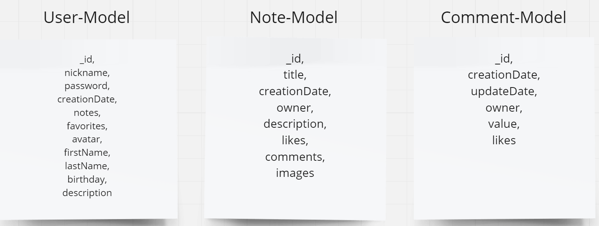

# ReddNotes


  <summary>
   <h2>Readme Description</h2>
  </summary>
  <br>
  <details>
This provides an overview of the WebSocket routes implemented in the backend code. These routes are designed to handle real-time communication through WebSocket connections. The code is written in Node.js using the Express framework with WebSocket support from the express-ws package.
</details>
  <br>
  <hr>

## <b>Prerequisites</b>

<ol>
-Node.js installed <br>
-MongoDB instance for data storage <br>
-Necessary dependencies installed (see package.json)
</ol>
  <hr>

## <b>Getting Started</b>

<ol>
1-Clone the <b>repository</b>.<br>
2-Install dependencies using <b>npm install</b>.<br>
3-Set up a <b> MongoDB</b> instance and update the connection details in  <b>"mongodb://localhost:27017/reddnotes"</b> in <b>"index.js"</b>.<br>
5-Create a <b>.env </b>file and configure environment variables, if required.<br>
6-Run the server using <b> npm run dev</b>.

## <b>Structure</b>

<b>index.js:</b> Main entry point containing <b>server</b> setup, middleware configuration, and WebSocket <b>route</b> handling.<br>
<b>controllers:</b> Contains controllers for handling various WebSocket <b>actions</b>.<br>
<b>errors:</b> Custom error classes for better <b>error</b> handling.<br>
<b>middlewares:</b> Middleware functions, including authentication.<br>
<b>utils:</b> Constants and utility functions.<br>

 <hr>

## WebSocket Routes <b></b>

<b>"/websocket"</b><br>
<b>mainHandler:</b>Handles WebSocket<b>connections</b> ,<b>message parsing</b>, and <b>routing</b> to appropriate controllers based on the received data <b>type</b>,<b>action</b>, and <b>method</b>.

## Auth

### login

- method _by token_ : `Login using a token.`
- method _by data_ : `Login using nickname and password`

### signup

- `Register a new user using nickname and password`

## User

### update

- `Update user information`

### get

- method _all_ : `Get information about all users.`
- method _one by token_ : `Get information about the logged-in user by tocken`
- method _one by Id_ : `Get information about a user by ID`

## Info

### count all users

- `Get the count of all users`

### count all notes

- `Get the count of all notes`

## Note

### get

- method _all_ : `Get all notes information`

### create

- `create a new note`

## Comment

### create

- `Create one new comment to note`

### update

- `Update the value of a comment by Id`

### delete

- `Delete the comment by Id`

## Websocket Events

### message:

    ```
    Handles incoming WebSocket messages and routes them to the approptiate controller functions.
    ```

### close:

    ```
    Handles WebSocket disconnections and updates the list of active connections.
    ```

## Server Setup

- 1. Initializes the Express server with WebSocket support.
- 2. Connects to MongoDB.
- 3. Listens for incoming connections on the specified port.

## Backend Architecture





## Color Pallet


